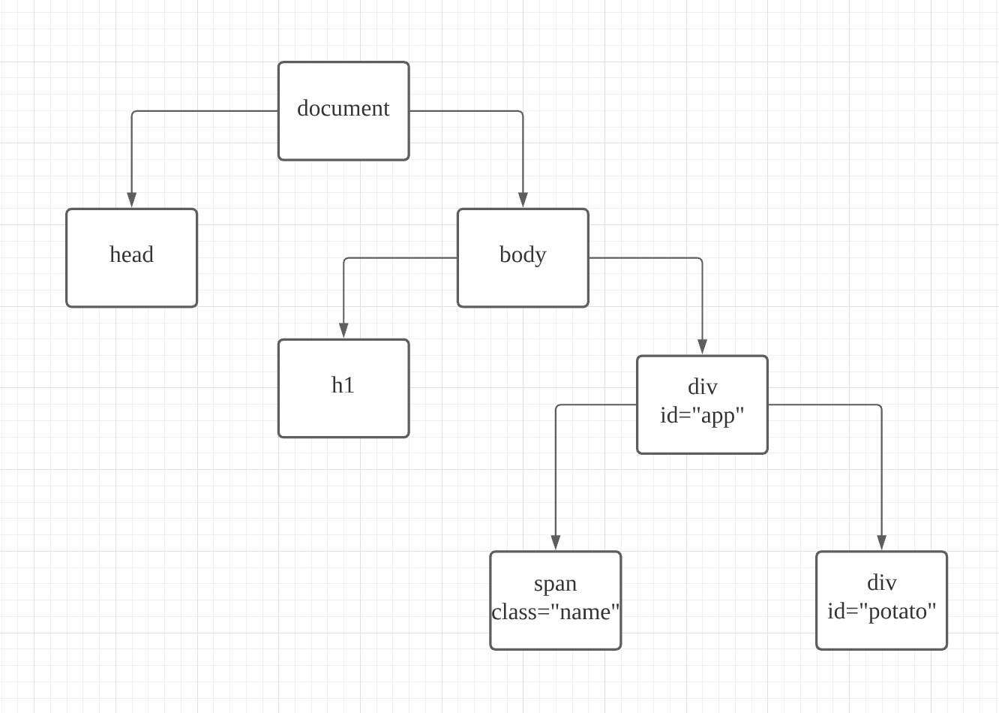

# [ITEC] JS Study

> 3 week

> arrow func, DOM, Template literals

> ⓒ yoon sang seok all rights reserved.

---

# Contents

0. 챌린지 코드 리뷰
1. arrow func
2. DOM의 이해
3. Template literals (기본)

---

# 0. 첼린지 코드 리뷰

---

# 1. arrow func

- 일반적인 함수 선언식
- 일반적인 함수 표현식
- arrow function
- default value

---

## 일반적인 함수 선언식

```js
function printNumber(number) {
  if (number) {
    console.log(number);
  } else {
    console.log("?");
  }
}

printNumber(7); // 7
printNumber(null); // ?
```

---

## 일반적인 함수 표현식

- **함수 선언식은 호이스팅에 영향을 받지만, 함수 표현식은 호이스팅에 영향을 받지 않는다.**
- 함수 표현식은 콜백 함수로 사용된다. (다른 함수의 인자로 넘길 수 있음)

```js
const printNumber = function (number) {
  console.log(number);
};
printNumber(17); // 17
```

```js
printNumber1(17); // 17
printNumber2(18); // Error

function printNumber1(number) {
  // 함수 선언식
  console.log(number);
}
const printNumber2 = function (number) {
  // 함수 표현식
  console.log(number);
};
```

---

## Arrow Function

```js
const print = (x) => console.log(x);

print("191919"); // 191919

const testFunction = () => {
  console.log("hello potato!");
  return 17;
};

testFunction();

// 콜백함수로서
const myArray = [1, 2, 3];

console.log(
  myArray.map((number) => {
    return number * 2;
  })
); // [2, 4, 6]

console.log(myArray.map((number) => number * 2));
// [2, 4, 6]
```

- [관련 docs](https://github.com/amamov/js-and-ts/blob/main/JavaScript/03%20Functions.md)

---

### [실습] 사칙연산 함수 (add, minus, product, div) Arrow func으로 만들기

---

### Default value

```js
const helloWorld = (hello = "hello") => hello + "world!";

console.log(helloWorld()); // hello world!
console.log(helloWorld("f")); // f world!
```

---

## 2. DOM의 이해

---



---

```html
<html>
  ...
  <body>
    <div id="app">hello potato!</div>
    <script src="src/index.js"></script>
  </body>
</html>
```

```js
const app = document.getElementById("app");
const test = document.createElement("div");
const testInTest = document.createElement("div");

test.id = "wow";
test.innerText = "wow this is sang seok";
test.appendChild(testInTest);
app.appendChild(test);

testInTest.innerHTML = "<h1>JS is potato</h1>";
test.style.background = "skyblue";

console.log(app);
```

---

```html
<html>
  ...
  <body>
    <button id="potato_click">potato click</button>
    <div id="print"></div>
    <script src="src/index.js"></script>
  </body>
</html>
```

```js
const printDom = document.getElementById("print");
const button = document.getElementById("potato_click");

const hendleClick = () => {
  printDom.innerHTML = "<h1>Hello Potato!</h1>";
};

button.addEventListener("click", hendleClick);
```

---

### [실습] 클릭하면 이미지 나오고 다시 클릭하면 이미지 사라지는 이미지 스위치 만들기

---

# 3. Template literals (기본)

---

## Template literals

```js
const helloWorld = (hello = "hello") => `${hello} world!`;
console.log(helloWorld()); // hello world!
```

```js
const wrapper = document.querySelector(".wrap");
const addWelcome = () => {
  // const helloBox = document.createElement("div");
  // const h1 = document.createElement("h1");
  // h1.innerText = "hello";
  // helloBox.append(h1);
  // wrapper.append(helloBox);
  const helloBox = `
    <div class="hello">
      <h1 class="title">Hello</h1>
    </div>
  `;
  wrapper.innerHTML = div;
};

setTimeout(addWelcome, 1000);
```

---

# 첼린지

1. [모던 JS](https://ko.javascript.info) - [파트 1. 2.18까지 정독], [파트 2. 1.4까지 정독]

2. 시뮬레이션 게임을 DOM에 표현 (MBTI 등등, 주제는 자유)

   - 페이지는 최소 4 페이지 이상
   - 주제 미정이거나 지난주 첼린지가 어려웠던 분들은 개인톡 주시면 주제 정해드립니다.

---

# 👻

> ⓒ yoon sang seok all rights reserved.
