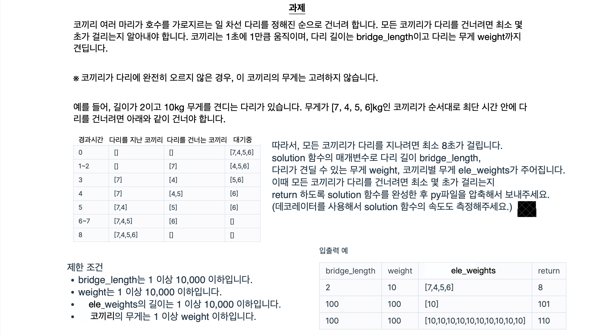

# 6 week 스터디

---

# Contents

1. 과제 코드 코멘트

2. decorator 다시 보기

3. flask 란??

4. flask template engine

5. 과제

---

# 1. 과제 코드 코멘트

---



---

# 해답 코드

```python
def solution(bridge_length, weight, ele_weights):
    time = 0
    bridge = [0] * bridge_length
    while bridge:
        time += 1
        bridge.pop(0)
        if ele_weights:
            if sum(bridge) + ele_weights[0] <= weight:
                bridge.append(ele_weights.pop(0))
            else:
                bridge.append(0)
    return time
```

> [문제 출처](https://programmers.co.kr/learn/courses/30/lessons/42583)

---

# 2. decorator 다시 보기

---

```python
def somthing_decorator(func):

	def inner():
		print("This is emooticon")
		func()

	return inner

def smile():
	print("^_^")

decorated_simle = somthing_decorator(smile)

decorated_simle()

"""
[출력결과]
This is emooticon
^_^
"""
```

---

```python
def somthing_decorator(func):

	def inner():
		print("This is emooticon")
		func()

	return inner

@somthing_decorator
def smile():
	print("^_^")

smile()

'''
[출력결과]
This is emooticon
^_^
'''
```

---

# 3. flask 란??

---

---

# 4. flask template engine

---

---

# 5. 과제

- flask와 template를 연결해서 웹 개발 해서 컨테이너 공유 링크 보내주시기
  - 주제는 자유입니다.
  - 기존의 프런트엔드 과제물을 연결 하셔도 좋습니다.
  - 다음주 과제도 동일하게 나갑니다.

> 다음주? (2월 16일)
>
> - flask와 template 엔진을 조금 더 깊게 사용해 보는 시간을 가지겠습니다.
